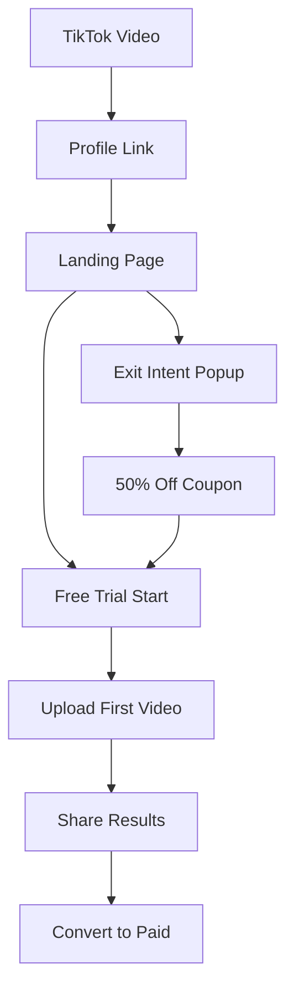
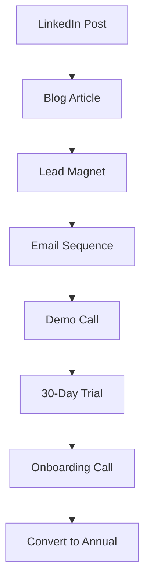

# ViralSplit & ContentMulti - Complete Development & Business Guide

## Executive Overview

### Your Assets
- **ViralSplit.io** - Consumer brand (B2C) for viral growth
- **ContentMulti.com** - Professional brand (B2B) for agencies/brands
- **Market**: 207M creators, $528B by 2030
- **Goal**: $335K MRR Year 1, Exit $15-20M Year 2

### The Dual-Brand Strategy
```
ViralSplit.io → Fun, viral, TikTok creators
ContentMulti.com → Professional, agencies, businesses
Same backend → Different positioning → 2x TAM
```

---

## Phase 1: Technical Foundation (Week 1-2)

### Day 1-2: Project Setup

#### 1. Repository Structure
```bash
# Create monorepo structure
mkdir viralsplit-platform
cd viralsplit-platform
git init

# Directory structure
viralsplit-platform/
├── apps/
│   ├── viralsplit/        # ViralSplit.io frontend
│   ├── contentmulti/      # ContentMulti.com frontend
│   └── api/               # Shared FastAPI backend
├── packages/
│   ├── ui/                # Shared UI components
│   ├── core/              # Core video processing
│   └── types/             # TypeScript types
├── infrastructure/
│   ├── docker/
│   └── terraform/
└── docs/
```

#### 2. Initialize Projects
```bash
# Frontend setup (both brands)
cd apps
npx create-next-app@latest viralsplit --typescript --tailwind --app
npx create-next-app@latest contentmulti --typescript --tailwind --app

# Backend setup
cd api
python -m venv venv
source venv/bin/activate  # Windows: venv\Scripts\activate

# Create requirements.txt
cat > requirements.txt << EOF
fastapi==0.104.1
uvicorn[standard]==0.24.0
python-multipart==0.0.6
boto3==1.29.7
cloudflare==2.11.7
openai==1.3.5
replicate==0.22.0
modal==0.56.0
redis==5.0.1
celery==5.3.4
stripe==7.5.0
supabase==2.0.3
ffmpeg-python==0.2.0
pillow==10.1.0
numpy==1.24.3
opencv-python==4.8.1.78
moviepy==1.0.3
pytest==7.4.3
black==23.11.0
EOF

pip install -r requirements.txt
```

#### 3. Environment Configuration
```bash
# Create .env.local for both frontends
cat > apps/viralsplit/.env.local << EOF
NEXT_PUBLIC_APP_NAME=ViralSplit
NEXT_PUBLIC_APP_URL=https://viralsplit.io
NEXT_PUBLIC_API_URL=http://localhost:8000
NEXT_PUBLIC_SUPABASE_URL=your_supabase_url
NEXT_PUBLIC_SUPABASE_ANON_KEY=your_anon_key
NEXT_PUBLIC_STRIPE_PUBLISHABLE_KEY=your_stripe_key
NEXT_PUBLIC_CLOUDFLARE_ACCOUNT_ID=your_cf_id
EOF

# Copy and modify for ContentMulti
cp apps/viralsplit/.env.local apps/contentmulti/.env.local
# Edit to change APP_NAME and APP_URL

# Backend .env
cat > apps/api/.env << EOF
DATABASE_URL=postgresql://...
REDIS_URL=redis://localhost:6379
OPENAI_API_KEY=sk-...
REPLICATE_API_TOKEN=r8_...
MODAL_TOKEN_ID=...
CLOUDFLARE_ACCOUNT_ID=...
CLOUDFLARE_ACCESS_KEY_ID=...
CLOUDFLARE_SECRET_ACCESS_KEY=...
STRIPE_SECRET_KEY=sk_...
STRIPE_WEBHOOK_SECRET=whsec_...
EOF
```

### Day 3-4: Core Infrastructure

#### 1. Database Schema (Supabase)
```sql
-- Users table (shared between brands)
CREATE TABLE users (
    id UUID PRIMARY KEY DEFAULT gen_random_uuid(),
    email TEXT UNIQUE NOT NULL,
    brand TEXT NOT NULL CHECK (brand IN ('viralsplit', 'contentmulti')),
    subscription_tier TEXT DEFAULT 'free',
    subscription_status TEXT DEFAULT 'active',
    created_at TIMESTAMPTZ DEFAULT NOW(),
    updated_at TIMESTAMPTZ DEFAULT NOW()
);

-- Projects/Videos table
CREATE TABLE projects (
    id UUID PRIMARY KEY DEFAULT gen_random_uuid(),
    user_id UUID REFERENCES users(id) ON DELETE CASCADE,
    title TEXT NOT NULL,
    original_url TEXT NOT NULL,
    status TEXT DEFAULT 'processing',
    metadata JSONB DEFAULT '{}',
    created_at TIMESTAMPTZ DEFAULT NOW()
);

-- Transformations table
CREATE TABLE transformations (
    id UUID PRIMARY KEY DEFAULT gen_random_uuid(),
    project_id UUID REFERENCES projects(id) ON DELETE CASCADE,
    platform TEXT NOT NULL,
    variant_type TEXT NOT NULL,
    output_url TEXT,
    thumbnail_url TEXT,
    metrics JSONB DEFAULT '{}',
    created_at TIMESTAMPTZ DEFAULT NOW()
);

-- Usage tracking
CREATE TABLE usage (
    id UUID PRIMARY KEY DEFAULT gen_random_uuid(),
    user_id UUID REFERENCES users(id) ON DELETE CASCADE,
    action TEXT NOT NULL,
    credits_used INTEGER DEFAULT 1,
    metadata JSONB DEFAULT '{}',
    created_at TIMESTAMPTZ DEFAULT NOW()
);

-- Templates marketplace
CREATE TABLE templates (
    id UUID PRIMARY KEY DEFAULT gen_random_uuid(),
    creator_id UUID REFERENCES users(id),
    name TEXT NOT NULL,
    description TEXT,
    config JSONB NOT NULL,
    price DECIMAL(10,2) DEFAULT 0,
    downloads INTEGER DEFAULT 0,
    rating DECIMAL(3,2),
    created_at TIMESTAMPTZ DEFAULT NOW()
);
```

#### 2. Cloudflare R2 Setup
```python
# apps/api/services/storage.py
import boto3
from botocore.client import Config

class R2Storage:
    def __init__(self):
        self.client = boto3.client(
            's3',
            endpoint_url=f'https://{ACCOUNT_ID}.r2.cloudflarestorage.com',
            aws_access_key_id=ACCESS_KEY_ID,
            aws_secret_access_key=SECRET_ACCESS_KEY,
            config=Config(signature_version='s3v4'),
            region_name='auto'
        )
        self.bucket = 'viralsplit-media'
    
    def upload_video(self, file_path: str, key: str):
        """Upload video to R2 with zero egress fees"""
        with open(file_path, 'rb') as f:
            self.client.upload_fileobj(
                f, 
                self.bucket, 
                key,
                ExtraArgs={
                    'ContentType': 'video/mp4',
                    'CacheControl': 'max-age=31536000'
                }
            )
        return f"https://cdn.viralsplit.io/{key}"
    
    def generate_upload_url(self, key: str, expires_in: int = 3600):
        """Generate presigned URL for direct browser upload"""
        return self.client.generate_presigned_url(
            'put_object',
            Params={'Bucket': self.bucket, 'Key': key},
            ExpiresIn=expires_in
        )
```

### Day 5-6: Video Processing Pipeline

#### 1. Core Video Processor
```python
# apps/api/services/video_processor.py
import ffmpeg
from typing import List, Dict
import tempfile
import os

class VideoProcessor:
    """Core video transformation engine"""
    
    PLATFORM_SPECS = {
        'tiktok': {
            'resolution': (1080, 1920),  # 9:16
            'duration': 60,
            'fps': 30,
            'bitrate': '6M'
        },
        'instagram_reels': {
            'resolution': (1080, 1920),  # 9:16
            'duration': 90,
            'fps': 30,
            'bitrate': '5M'
        },
        'youtube_shorts': {
            'resolution': (1080, 1920),  # 9:16
            'duration': 60,
            'fps': 30,
            'bitrate': '8M'
        },
        'instagram_feed': {
            'resolution': (1080, 1080),  # 1:1
            'duration': 60,
            'fps': 30,
            'bitrate': '5M'
        },
        'twitter': {
            'resolution': (1280, 720),  # 16:9
            'duration': 140,
            'fps': 30,
            'bitrate': '5M'
        },
        'linkedin': {
            'resolution': (1280, 720),  # 16:9
            'duration': 600,
            'fps': 30,
            'bitrate': '5M'
        }
    }
    
    def __init__(self, storage: R2Storage):
        self.storage = storage
    
    async def process_video(self, input_url: str, platforms: List[str]) -> Dict:
        """Process video for multiple platforms"""
        results = {}
        
        # Download original
        with tempfile.NamedTemporaryFile(suffix='.mp4') as tmp_input:
            # Download from R2
            await self._download_video(input_url, tmp_input.name)
            
            # Process for each platform
            for platform in platforms:
                spec = self.PLATFORM_SPECS[platform]
                output_path = await self._transform_video(
                    tmp_input.name, 
                    platform, 
                    spec
                )
                
                # Upload to R2
                output_key = f"outputs/{platform}/{os.path.basename(output_path)}"
                output_url = self.storage.upload_video(output_path, output_key)
                
                results[platform] = {
                    'url': output_url,
                    'spec': spec
                }
        
        return results
    
    async def _transform_video(self, input_path: str, platform: str, spec: dict):
        """Transform video for specific platform"""
        output_path = tempfile.mktemp(suffix=f'_{platform}.mp4')
        
        # Basic transformation
        stream = ffmpeg.input(input_path)
        
        # Crop/pad for aspect ratio
        stream = self._adjust_aspect_ratio(stream, spec['resolution'])
        
        # Trim duration if needed
        if spec['duration']:
            stream = stream.trim(duration=spec['duration'])
        
        # Output with platform specs
        stream = ffmpeg.output(
            stream,
            output_path,
            vcodec='libx264',
            acodec='aac',
            r=spec['fps'],
            video_bitrate=spec['bitrate'],
            preset='fast',
            movflags='faststart'
        )
        
        ffmpeg.run(stream, overwrite_output=True)
        return output_path
    
    def _adjust_aspect_ratio(self, stream, target_resolution):
        """Smart crop/pad for aspect ratio"""
        width, height = target_resolution
        aspect = width / height
        
        # Get input dimensions (simplified)
        # In production, probe the video first
        
        # Smart crop to center
        return stream.filter('crop', width, height)
```

#### 2. AI Enhancement Pipeline
```python
# apps/api/services/ai_enhancer.py
import openai
import replicate
from typing import List, Dict

class AIEnhancer:
    """AI-powered video enhancements"""
    
    def __init__(self):
        self.openai_client = openai.Client()
        self.replicate_client = replicate.Client()
    
    async def generate_captions(self, audio_url: str) -> str:
        """Generate captions using Whisper"""
        response = await self.openai_client.audio.transcriptions.create(
            model="whisper-1",
            file=open(audio_url, "rb"),
            response_format="srt"
        )
        return response.text
    
    async def generate_hooks(self, transcript: str, num_hooks: int = 3) -> List[str]:
        """Generate multiple hook variations"""
        prompt = f"""
        Based on this video transcript, create {num_hooks} different 
        attention-grabbing hooks (first 3 seconds) that would work on TikTok.
        
        Transcript: {transcript[:500]}
        
        Return as JSON array of hooks.
        """
        
        response = await self.openai_client.chat.completions.create(
            model="gpt-4-turbo-preview",
            messages=[{"role": "user", "content": prompt}],
            response_format={"type": "json_object"}
        )
        return response.choices[0].message.content
    
    async def match_trending_audio(self, video_metadata: dict) -> dict:
        """Match video with trending audio"""
        # In production: Query TikTok API for trending sounds
        # For MVP: Use predefined trending sound library
        
        trending_sounds = [
            {"id": "sound1", "name": "Trending Beat 1", "url": "..."},
            {"id": "sound2", "name": "Viral Sound 2", "url": "..."}
        ]
        
        # Simple matching logic (enhance with AI later)
        return trending_sounds[0]
    
    async def generate_thumbnail(self, video_url: str) -> List[str]:
        """Generate thumbnail variations"""
        # Extract key frames
        frames = await self._extract_key_frames(video_url)
        
        # Enhance with AI
        thumbnails = []
        for frame in frames[:3]:
            # Use Replicate for enhancement
            output = await self.replicate_client.run(
                "stability-ai/sdxl:image-to-image",
                input={
                    "image": frame,
                    "prompt": "professional thumbnail, high contrast, viral",
                    "strength": 0.5
                }
            )
            thumbnails.append(output)
        
        return thumbnails
```

### Day 7-8: API Development

#### 1. FastAPI Backend Structure
```python
# apps/api/main.py
from fastapi import FastAPI, HTTPException, Depends, UploadFile
from fastapi.middleware.cors import CORSMiddleware
from typing import List, Optional
import asyncio
from celery import Celery

app = FastAPI(title="ViralSplit/ContentMulti API")

# CORS for both domains
app.add_middleware(
    CORSMiddleware,
    allow_origins=[
        "https://viralsplit.io",
        "https://contentmulti.com",
        "http://localhost:3000",
        "http://localhost:3001"
    ],
    allow_credentials=True,
    allow_methods=["*"],
    allow_headers=["*"],
)

# Celery for background tasks
celery_app = Celery(
    'tasks',
    broker='redis://localhost:6379',
    backend='redis://localhost:6379'
)

# ===== ENDPOINTS =====

@app.post("/api/upload/request")
async def request_upload(
    filename: str,
    user: dict = Depends(get_current_user)
):
    """Generate presigned URL for direct upload"""
    key = f"uploads/{user['id']}/{filename}"
    upload_url = storage.generate_upload_url(key)
    
    # Create project record
    project = await db.projects.create({
        'user_id': user['id'],
        'title': filename,
        'original_url': f"https://cdn.viralsplit.io/{key}",
        'status': 'uploading'
    })
    
    return {
        'upload_url': upload_url,
        'project_id': project['id']
    }

@app.post("/api/projects/{project_id}/transform")
async def transform_video(
    project_id: str,
    platforms: List[str],
    options: dict = {},
    user: dict = Depends(get_current_user)
):
    """Start video transformation job"""
    # Verify ownership
    project = await db.projects.get(project_id)
    if project['user_id'] != user['id']:
        raise HTTPException(403, "Not authorized")
    
    # Check credits
    credits_needed = len(platforms) * 10  # 10 credits per platform
    if user['credits'] < credits_needed:
        raise HTTPException(402, "Insufficient credits")
    
    # Queue transformation job
    task = transform_video_task.delay(
        project_id=project_id,
        platforms=platforms,
        options=options
    )
    
    # Update project status
    await db.projects.update(project_id, {
        'status': 'processing',
        'task_id': task.id
    })
    
    return {'task_id': task.id, 'status': 'processing'}

@app.get("/api/projects/{project_id}/status")
async def get_project_status(
    project_id: str,
    user: dict = Depends(get_current_user)
):
    """Get transformation status"""
    project = await db.projects.get(project_id)
    
    if project['user_id'] != user['id']:
        raise HTTPException(403, "Not authorized")
    
    # Get transformations
    transformations = await db.transformations.filter(
        project_id=project_id
    )
    
    return {
        'project': project,
        'transformations': transformations
    }

# ===== CELERY TASKS =====

@celery_app.task
def transform_video_task(project_id: str, platforms: List[str], options: dict):
    """Background task for video transformation"""
    processor = VideoProcessor(storage)
    enhancer = AIEnhancer()
    
    try:
        # Get project
        project = db.projects.get_sync(project_id)
        
        # Process video
        results = processor.process_video_sync(
            project['original_url'],
            platforms
        )
        
        # AI enhancements
        for platform, result in results.items():
            # Generate captions
            captions = enhancer.generate_captions_sync(result['url'])
            
            # Generate thumbnails
            thumbnails = enhancer.generate_thumbnail_sync(result['url'])
            
            # Save transformation
            db.transformations.create_sync({
                'project_id': project_id,
                'platform': platform,
                'output_url': result['url'],
                'thumbnail_url': thumbnails[0],
                'metadata': {
                    'captions': captions,
                    'thumbnails': thumbnails,
                    'spec': result['spec']
                }
            })
        
        # Update project status
        db.projects.update_sync(project_id, {'status': 'completed'})
        
        # Send notification
        send_completion_email(project['user_id'], project_id)
        
    except Exception as e:
        db.projects.update_sync(project_id, {
            'status': 'failed',
            'error': str(e)
        })
        raise
```

### Day 9-10: Frontend Development

#### 1. Shared UI Components
```tsx
// packages/ui/components/VideoUploader.tsx
import React, { useCallback, useState } from 'react';
import { useDropzone } from 'react-dropzone';
import { Upload, X, Loader2 } from 'lucide-react';

interface VideoUploaderProps {
  onUpload: (file: File) => Promise<void>;
  maxSize?: number;
  brand: 'viralsplit' | 'contentmulti';
}

export const VideoUploader: React.FC<VideoUploaderProps> = ({
  onUpload,
  maxSize = 500 * 1024 * 1024, // 500MB
  brand
}) => {
  const [uploading, setUploading] = useState(false);
  const [progress, setProgress] = useState(0);
  
  const onDrop = useCallback(async (acceptedFiles: File[]) => {
    const file = acceptedFiles[0];
    if (!file) return;
    
    setUploading(true);
    
    try {
      // Request upload URL
      const response = await fetch('/api/upload/request', {
        method: 'POST',
        headers: { 'Content-Type': 'application/json' },
        body: JSON.stringify({ filename: file.name })
      });
      
      const { upload_url, project_id } = await response.json();
      
      // Upload directly to R2
      await uploadToR2(file, upload_url, setProgress);
      
      // Notify backend
      await onUpload(file);
      
    } catch (error) {
      console.error('Upload failed:', error);
    } finally {
      setUploading(false);
      setProgress(0);
    }
  }, [onUpload]);
  
  const { getRootProps, getInputProps, isDragActive } = useDropzone({
    onDrop,
    accept: {
      'video/*': ['.mp4', '.mov', '.avi', '.webm']
    },
    maxSize,
    multiple: false
  });
  
  const brandStyles = {
    viralsplit: 'bg-gradient-to-r from-purple-600 to-pink-600',
    contentmulti: 'bg-gradient-to-r from-blue-600 to-cyan-600'
  };
  
  return (
    <div
      {...getRootProps()}
      className={`
        relative border-2 border-dashed rounded-xl p-12
        ${isDragActive ? 'border-white bg-opacity-10' : 'border-gray-600'}
        ${uploading ? 'pointer-events-none' : 'cursor-pointer'}
        transition-all duration-200 hover:border-white
      `}
    >
      <input {...getInputProps()} />
      
      {uploading ? (
        <div className="text-center">
          <Loader2 className="w-12 h-12 mx-auto mb-4 animate-spin" />
          <p className="text-lg mb-2">Uploading...</p>
          <div className="w-full bg-gray-700 rounded-full h-2">
            <div 
              className={`${brandStyles[brand]} h-2 rounded-full transition-all`}
              style={{ width: `${progress}%` }}
            />
          </div>
        </div>
      ) : (
        <div className="text-center">
          <Upload className="w-12 h-12 mx-auto mb-4 text-gray-400" />
          <p className="text-xl mb-2">
            {isDragActive ? 'Drop your video here' : 'Drag & drop your video'}
          </p>
          <p className="text-sm text-gray-400">or click to browse</p>
          <p className="text-xs text-gray-500 mt-4">
            MP4, MOV, AVI, WEBM • Max {maxSize / (1024 * 1024)}MB
          </p>
        </div>
      )}
    </div>
  );
};

async function uploadToR2(
  file: File, 
  uploadUrl: string, 
  onProgress: (progress: number) => void
): Promise<void> {
  return new Promise((resolve, reject) => {
    const xhr = new XMLHttpRequest();
    
    xhr.upload.addEventListener('progress', (e) => {
      if (e.lengthComputable) {
        const progress = (e.loaded / e.total) * 100;
        onProgress(progress);
      }
    });
    
    xhr.addEventListener('load', () => {
      if (xhr.status === 200) {
        resolve();
      } else {
        reject(new Error(`Upload failed: ${xhr.status}`));
      }
    });
    
    xhr.addEventListener('error', reject);
    
    xhr.open('PUT', uploadUrl);
    xhr.setRequestHeader('Content-Type', file.type);
    xhr.send(file);
  });
}
```

#### 2. Platform Selector Component
```tsx
// packages/ui/components/PlatformSelector.tsx
import React, { useState } from 'react';
import { Check } from 'lucide-react';

const PLATFORMS = [
  {
    id: 'tiktok',
    name: 'TikTok',
    icon: '🎵',
    aspect: '9:16',
    duration: '60s',
    popular: true
  },
  {
    id: 'instagram_reels',
    name: 'Instagram Reels',
    icon: '📱',
    aspect: '9:16',
    duration: '90s',
    popular: true
  },
  {
    id: 'youtube_shorts',
    name: 'YouTube Shorts',
    icon: '📺',
    aspect: '9:16',
    duration: '60s',
    popular: true
  },
  {
    id: 'instagram_feed',
    name: 'Instagram Feed',
    icon: '📷',
    aspect: '1:1',
    duration: '60s'
  },
  {
    id: 'twitter',
    name: 'Twitter/X',
    icon: '🐦',
    aspect: '16:9',
    duration: '2:20'
  },
  {
    id: 'linkedin',
    name: 'LinkedIn',
    icon: '💼',
    aspect: '16:9',
    duration: '10m'
  }
];

interface PlatformSelectorProps {
  selected: string[];
  onChange: (platforms: string[]) => void;
  brand: 'viralsplit' | 'contentmulti';
}

export const PlatformSelector: React.FC<PlatformSelectorProps> = ({
  selected,
  onChange,
  brand
}) => {
  const togglePlatform = (platformId: string) => {
    if (selected.includes(platformId)) {
      onChange(selected.filter(id => id !== platformId));
    } else {
      onChange([...selected, platformId]);
    }
  };
  
  const selectAll = () => onChange(PLATFORMS.map(p => p.id));
  const selectPopular = () => onChange(PLATFORMS.filter(p => p.popular).map(p => p.id));
  
  return (
    <div className="space-y-4">
      <div className="flex gap-2">
        <button
          onClick={selectPopular}
          className="px-4 py-2 bg-gray-800 rounded-lg hover:bg-gray-700"
        >
          Select Popular
        </button>
        <button
          onClick={selectAll}
          className="px-4 py-2 bg-gray-800 rounded-lg hover:bg-gray-700"
        >
          Select All
        </button>
      </div>
      
      <div className="grid grid-cols-2 md:grid-cols-3 gap-4">
        {PLATFORMS.map(platform => (
          <div
            key={platform.id}
            onClick={() => togglePlatform(platform.id)}
            className={`
              relative p-4 rounded-lg border-2 cursor-pointer
              transition-all duration-200
              ${selected.includes(platform.id) 
                ? brand === 'viralsplit'
                  ? 'border-purple-500 bg-purple-500/10'
                  : 'border-blue-500 bg-blue-500/10'
                : 'border-gray-700 hover:border-gray-600'
              }
            `}
          >
            {selected.includes(platform.id) && (
              <Check className="absolute top-2 right-2 w-5 h-5" />
            )}
            
            <div className="text-2xl mb-2">{platform.icon}</div>
            <div className="font-semibold">{platform.name}</div>
            <div className="text-xs text-gray-400 mt-1">
              {platform.aspect} • {platform.duration}
            </div>
            
            {platform.popular && (
              <div className="absolute top-2 left-2">
                <span className="text-xs bg-yellow-500/20 text-yellow-500 px-2 py-1 rounded">
                  Popular
                </span>
              </div>
            )}
          </div>
        ))}
      </div>
    </div>
  );
};
```

#### 3. ViralSplit Frontend
```tsx
// apps/viralsplit/app/page.tsx
'use client';

import { useState } from 'react';
import { VideoUploader, PlatformSelector } from '@viralsplit/ui';
import { motion } from 'framer-motion';

export default function Home() {
  const [step, setStep] = useState<'upload' | 'configure' | 'processing' | 'complete'>('upload');
  const [projectId, setProjectId] = useState<string>('');
  const [selectedPlatforms, setSelectedPlatforms] = useState<string[]>([]);
  
  const handleUpload = async (file: File) => {
    setStep('configure');
    // Project ID is already set from upload response
  };
  
  const startTransformation = async () => {
    setStep('processing');
    
    const response = await fetch(`/api/projects/${projectId}/transform`, {
      method: 'POST',
      headers: { 'Content-Type': 'application/json' },
      body: JSON.stringify({ platforms: selectedPlatforms })
    });
    
    // Poll for completion
    pollForCompletion(projectId);
  };
  
  return (
    <div className="min-h-screen bg-black text-white">
      {/* Animated gradient background */}
      <div className="fixed inset-0 bg-gradient-to-br from-purple-900/20 via-black to-pink-900/20" />
      
      <div className="relative z-10 container mx-auto px-4 py-12">
        {/* Hero Section */}
        <motion.div 
          initial={{ opacity: 0, y: 20 }}
          animate={{ opacity: 1, y: 0 }}
          className="text-center mb-12"
        >
          <h1 className="text-5xl md:text-7xl font-bold mb-4">
            <span className="bg-gradient-to-r from-purple-400 to-pink-400 bg-clip-text text-transparent">
              Split Your Content
            </span>
          </h1>
          <p className="text-xl text-gray-400">
            Go viral on every platform with one upload
          </p>
        </motion.div>
        
        {/* Main Content */}
        <div className="max-w-4xl mx-auto">
          {step === 'upload' && (
            <motion.div
              initial={{ opacity: 0, scale: 0.9 }}
              animate={{ opacity: 1, scale: 1 }}
            >
              <VideoUploader 
                onUpload={handleUpload}
                brand="viralsplit"
              />
              
              {/* Social Proof */}
              <div className="mt-8 flex items-center justify-center gap-8 text-gray-400">
                <div className="text-center">
                  <div className="text-2xl font-bold text-white">10M+</div>
                  <div className="text-sm">Videos Processed</div>
                </div>
                <div className="text-center">
                  <div className="text-2xl font-bold text-white">500K+</div>
                  <div className="text-sm">Creators</div>
                </div>
                <div className="text-center">
                  <div className="text-2xl font-bold text-white">2.5B+</div>
                  <div className="text-sm">Views Generated</div>
                </div>
              </div>
            </motion.div>
          )}
          
          {step === 'configure' && (
            <motion.div
              initial={{ opacity: 0, x: 20 }}
              animate={{ opacity: 1, x: 0 }}
              className="space-y-8"
            >
              <h2 className="text-3xl font-bold">Choose Your Platforms</h2>
              
              <PlatformSelector
                selected={selectedPlatforms}
                onChange={setSelectedPlatforms}
                brand="viralsplit"
              />
              
              <button
                onClick={startTransformation}
                disabled={selectedPlatforms.length === 0}
                className="w-full py-4 bg-gradient-to-r from-purple-600 to-pink-600 rounded-lg font-bold text-lg hover:opacity-90 transition disabled:opacity-50"
              >
                Transform My Video ({selectedPlatforms.length} platforms)
              </button>
            </motion.div>
          )}
          
          {step === 'processing' && (
            <ProcessingAnimation />
          )}
          
          {step === 'complete' && (
            <ResultsView projectId={projectId} />
          )}
        </div>
      </div>
    </div>
  );
}
```

---

## Phase 2: Business Development (Week 3-4)

### Marketing Implementation

#### 1. Content Creation Pipeline
```python
# scripts/content_generator.py
"""
Generate daily content for both brands
Run via GitHub Actions daily
"""

import openai
from datetime import datetime
import json

class ContentGenerator:
    def __init__(self):
        self.platforms = {
            'tiktok': self.generate_tiktok_content,
            'twitter': self.generate_twitter_content,
            'linkedin': self.generate_linkedin_content
        }
    
    def generate_daily_content(self):
        """Generate content for all platforms"""
        date = datetime.now().strftime('%Y-%m-%d')
        content = {}
        
        # ViralSplit content (fun, viral)
        content['viralsplit'] = {
            'tiktok': self.generate_tiktok_content('viralsplit'),
            'twitter': self.generate_twitter_content('viralsplit'),
            'instagram': self.generate_instagram_content('viralsplit')
        }
        
        # ContentMulti content (professional)
        content['contentmulti'] = {
            'linkedin': self.generate_linkedin_content('contentmulti'),
            'twitter': self.generate_twitter_content('contentmulti'),
            'blog': self.generate_blog_post('contentmulti')
        }
        
        # Save to content calendar
        with open(f'content/{date}.json', 'w') as f:
            json.dump(content, f, indent=2)
        
        return content
    
    def generate_tiktok_content(self, brand):
        """Generate TikTok video ideas"""
        prompts = {
            'viralsplit': [
                "How I went from 0 to 100K using ViralSplit",
                "POV: You discover ViralSplit exists",
                "Rating viral tools (ViralSplit is 10/10)",
                "One video = 30 platforms challenge"
            ],
            'contentmulti': [
                "How agencies save 20 hours/week",
                "Corporate content strategy in 60 seconds",
                "Why brands use ContentMulti"
            ]
        }
        
        return {
            'ideas': prompts[brand],
            'hashtags': self.generate_hashtags(brand),
            'sounds': self.get_trending_sounds()
        }
```

#### 2. Launch Campaigns

##### Campaign 1: "7-Day Viral Challenge" (ViralSplit)
```markdown
# 7-Day Viral Challenge

## Concept
Creators post one video daily using ViralSplit, track which platform performs best

## Mechanics
1. Sign up for free trial
2. Upload one video daily
3. Share results with #ViralSplitChallenge
4. Best performer wins $1,000 + lifetime access

## Promotion
- Partner with 10 micro-influencers
- Daily prizes ($100 Amazon cards)
- Leaderboard on website
- Email sequence to participants

## Expected Results
- 1,000 participants
- 7,000 videos created
- 200 paid conversions (20%)
- Viral moment potential
```

##### Campaign 2: "Agency Accelerator" (ContentMulti)
```markdown
# Agency Accelerator Program

## Target
Social media agencies, freelancers, brand managers

## Offer
- 30-day free trial (no credit card)
- White-label option included
- Training webinar weekly
- Dedicated Slack channel

## Outreach
- LinkedIn direct messages to agencies
- Guest posts on marketing blogs
- Webinars with industry leaders
- Case studies from beta users

## Conversion Path
1. LinkedIn ad → Landing page
2. Book demo call
3. 30-day trial
4. Convert to $297/month plan
```

### Pricing & Monetization

#### Dynamic Pricing Engine
```python
# apps/api/services/pricing.py
from datetime import datetime
from typing import Dict, Optional

class PricingEngine:
    """Dynamic pricing based on brand and user behavior"""
    
    BASE_PRICES = {
        'viralsplit': {
            'starter': 47,
            'pro': 97,
            'team': 197
        },
        'contentmulti': {
            'professional': 97,
            'business': 297,
            'enterprise': 597
        }
    }
    
    def calculate_price(
        self, 
        brand: str, 
        tier: str, 
        user_data: Optional[Dict] = None
    ) -> Dict:
        """Calculate personalized pricing"""
        base_price = self.BASE_PRICES[brand][tier]
        
        # Apply discounts
        discount = 0
        
        # Early bird discount (first 1000 users)
        if self.get_total_users() < 1000:
            discount += 0.5  # 50% off
        
        # Annual billing discount
        if user_data and user_data.get('billing_period') == 'annual':
            discount += 0.2  # 20% off
        
        # Referral discount
        if user_data and user_data.get('referred_by'):
            discount += 0.3  # 30% off first month
        
        # Student discount (ViralSplit only)
        if brand == 'viralsplit' and user_data and user_data.get('is_student'):
            discount += 0.4  # 40% off
        
        # Calculate final price
        final_price = base_price * (1 - min(discount, 0.7))  # Max 70% off
        
        return {
            'base_price': base_price,
            'discount_percentage': discount * 100,
            'final_price': round(final_price, 2),
            'savings': round(base_price - final_price, 2),
            'currency': 'USD'
        }
```

### Customer Acquisition Funnels

#### ViralSplit Funnel (B2C)


#### ContentMulti Funnel (B2B)


---

## Phase 3: Growth & Optimization (Week 5-8)

### Analytics & Tracking

#### 1. Metrics Dashboard
```python
# apps/api/services/analytics.py
from typing import Dict, List
from datetime import datetime, timedelta
import pandas as pd

class AnalyticsService:
    """Track key metrics for both brands"""
    
    def get_key_metrics(self, brand: str, period: str = '7d') -> Dict:
        """Get dashboard metrics"""
        
        metrics = {
            'mrr': self.calculate_mrr(brand),
            'growth_rate': self.calculate_growth_rate(brand, period),
            'churn_rate': self.calculate_churn(brand, period),
            'cac': self.calculate_cac(brand, period),
            'ltv': self.calculate_ltv(brand),
            'viral_coefficient': self.calculate_viral_coefficient(brand),
            'platform_performance': self.get_platform_performance(brand)
        }
        
        # Brand-specific metrics
        if brand == 'viralsplit':
            metrics['viral_videos'] = self.count_viral_videos(period)
            metrics['creator_retention'] = self.creator_retention_rate()
        else:  # contentmulti
            metrics['agency_accounts'] = self.count_agency_accounts()
            metrics['white_label_usage'] = self.white_label_stats()
        
        return metrics
    
    def calculate_viral_coefficient(self, brand: str) -> float:
        """Calculate K-factor for viral growth"""
        invites_sent = self.get_invites_sent(brand)
        conversion_rate = self.get_invite_conversion_rate(brand)
        
        return invites_sent * conversion_rate
    
    def track_feature_usage(self) -> pd.DataFrame:
        """Track which features drive retention"""
        query = """
        SELECT 
            feature_name,
            COUNT(DISTINCT user_id) as unique_users,
            COUNT(*) as total_uses,
            AVG(CASE WHEN retained THEN 1 ELSE 0 END) as retention_impact
        FROM feature_usage
        JOIN users ON feature_usage.user_id = users.id
        WHERE created_at > NOW() - INTERVAL '30 days'
        GROUP BY feature_name
        ORDER BY retention_impact DESC
        """
        return pd.read_sql(query, self.db)
```

#### 2. A/B Testing Framework
```typescript
// packages/ui/lib/experiments.ts
interface Experiment {
  id: string;
  name: string;
  variants: Variant[];
  allocation: number;  // % of traffic
  metrics: string[];
}

class ExperimentManager {
  private experiments: Map<string, Experiment> = new Map();
  
  // Current experiments
  constructor() {
    this.register({
      id: 'onboarding_flow',
      name: 'Onboarding Flow Test',
      variants: [
        { id: 'control', weight: 0.5 },
        { id: 'guided', weight: 0.25 },
        { id: 'video', weight: 0.25 }
      ],
      allocation: 1.0,
      metrics: ['activation_rate', 'time_to_first_video']
    });
    
    this.register({
      id: 'pricing_display',
      name: 'Pricing Display Test',
      variants: [
        { id: 'monthly_default', weight: 0.5 },
        { id: 'annual_default', weight: 0.5 }
      ],
      allocation: 0.5,
      metrics: ['conversion_rate', 'revenue_per_user']
    });
  }
  
  getVariant(experimentId: string, userId: string): string {
    const experiment = this.experiments.get(experimentId);
    if (!experiment) return 'control';
    
    // Consistent assignment based on user ID
    const hash = this.hashUserId(userId, experimentId);
    const inExperiment = hash < experiment.allocation;
    
    if (!inExperiment) return 'control';
    
    // Assign to variant
    let cumulative = 0;
    for (const variant of experiment.variants) {
      cumulative += variant.weight;
      if (hash < cumulative) return variant.id;
    }
    
    return 'control';
  }
  
  track(experimentId: string, userId: string, event: string, value?: number) {
    // Send to analytics
    analytics.track({
      event: 'experiment_event',
      userId,
      properties: {
        experiment_id: experimentId,
        variant: this.getVariant(experimentId, userId),
        event_name: event,
        value
      }
    });
  }
}
```

### Performance Optimization

#### 1. Caching Strategy
```python
# apps/api/services/cache.py
import redis
import json
from functools import wraps
from typing import Optional, Any

class CacheService:
    def __init__(self):
        self.redis = redis.Redis(
            host='localhost',
            port=6379,
            decode_responses=True
        )
    
    def cache_result(self, ttl: int = 3600):
        """Decorator for caching function results"""
        def decorator(func):
            @wraps(func)
            async def wrapper(*args, **kwargs):
                # Generate cache key
                cache_key = f"{func.__name__}:{str(args)}:{str(kwargs)}"
                
                # Try to get from cache
                cached = self.redis.get(cache_key)
                if cached:
                    return json.loads(cached)
                
                # Execute function
                result = await func(*args, **kwargs)
                
                # Store in cache
                self.redis.setex(
                    cache_key,
                    ttl,
                    json.dumps(result)
                )
                
                return result
            return wrapper
        return decorator
    
    def invalidate_pattern(self, pattern: str):
        """Invalidate all keys matching pattern"""
        for key in self.redis.scan_iter(match=pattern):
            self.redis.delete(key)
```

#### 2. CDN Configuration
```javascript
// infrastructure/cloudflare-worker.js
addEventListener('fetch', event => {
  event.respondWith(handleRequest(event.request));
});

async function handleRequest(request) {
  const url = new URL(request.url);
  
  // Route to appropriate origin
  let origin = 'https://api.viralsplit.io';
  if (url.hostname.includes('contentmulti')) {
    origin = 'https://api.contentmulti.com';
  }
  
  // Cache strategy
  const cacheKey = new Request(url.toString(), request);
  const cache = caches.default;
  
  // Check cache first
  let response = await cache.match(cacheKey);
  
  if (!response) {
    // Fetch from origin
    response = await fetch(origin + url.pathname, request);
    
    // Cache successful responses
    if (response.status === 200) {
      const headers = new Headers(response.headers);
      headers.set('Cache-Control', 'public, max-age=3600');
      
      response = new Response(response.body, {
        status: response.status,
        statusText: response.statusText,
        headers: headers
      });
      
      event.waitUntil(cache.put(cacheKey, response.clone()));
    }
  }
  
  return response;
}
```

---

## Phase 4: Scale & Exit Preparation (Month 3-12)

### Feature Roadmap

#### Quarter 1 (Month 1-3)
- [x] Core MVP (upload, transform, download)
- [x] Basic AI features (captions, thumbnails)
- [x] Payment integration
- [x] Email notifications
- [ ] Mobile app (React Native)
- [ ] API for developers

#### Quarter 2 (Month 4-6)
- [ ] Template marketplace
- [ ] Team collaboration
- [ ] Advanced AI (voice cloning, style transfer)
- [ ] Webhook integrations
- [ ] White-label solution
- [ ] Analytics dashboard

#### Quarter 3 (Month 7-9)
- [ ] Enterprise features
- [ ] SSO/SAML
- [ ] Audit logs
- [ ] SLA guarantees
- [ ] International expansion
- [ ] Multi-language support

#### Quarter 4 (Month 10-12)
- [ ] AI auto-editor
- [ ] Performance predictor
- [ ] Competitor analysis
- [ ] Brand partnership matching
- [ ] Advanced automation
- [ ] Exit preparation

### Scaling Infrastructure

#### 1. Database Scaling
```sql
-- Implement sharding by user_id
CREATE TABLE projects_shard_1 PARTITION OF projects
  FOR VALUES WITH (modulus 4, remainder 0);
  
CREATE TABLE projects_shard_2 PARTITION OF projects
  FOR VALUES WITH (modulus 4, remainder 1);
  
-- Read replicas for analytics
CREATE PUBLICATION analytics_pub FOR TABLE users, projects, transformations;
CREATE SUBSCRIPTION analytics_sub 
  CONNECTION 'host=replica.db port=5432 dbname=analytics'
  PUBLICATION analytics_pub;
```

#### 2. Auto-scaling Configuration
```yaml
# infrastructure/kubernetes/autoscale.yaml
apiVersion: autoscaling/v2
kind: HorizontalPodAutoscaler
metadata:
  name: api-autoscaler
spec:
  scaleTargetRef:
    apiVersion: apps/v1
    kind: Deployment
    name: api-deployment
  minReplicas: 2
  maxReplicas: 20
  metrics:
  - type: Resource
    resource:
      name: cpu
      target:
        type: Utilization
        averageUtilization: 70
  - type: Resource
    resource:
      name: memory
      target:
        type: Utilization
        averageUtilization: 80
  - type: Pods
    pods:
      metric:
        name: pending_transformations
      target:
        type: AverageValue
        averageValue: "30"
```

### Exit Preparation

#### 1. Documentation Package
```markdown
# Exit Documentation Checklist

## Technical Documentation
- [ ] System architecture diagram
- [ ] API documentation (OpenAPI spec)
- [ ] Database schema and migrations
- [ ] Infrastructure as Code (Terraform)
- [ ] Deployment procedures
- [ ] Security audit report
- [ ] Performance benchmarks

## Business Documentation
- [ ] Financial statements (P&L, balance sheet)
- [ ] Customer contracts and agreements
- [ ] Intellectual property assignments
- [ ] Employee/contractor agreements
- [ ] Vendor contracts
- [ ] Insurance policies
- [ ] Tax returns (2 years)

## Metrics Package
- [ ] MRR growth chart
- [ ] Cohort retention analysis
- [ ] CAC/LTV by channel
- [ ] Churn analysis
- [ ] Feature usage data
- [ ] Customer testimonials
- [ ] Market size analysis
```

#### 2. Acquisition Targets & Positioning
```python
# scripts/acquisition_outreach.py
POTENTIAL_ACQUIRERS = {
    'strategic': {
        'Adobe': {
            'contact': 'Corp Dev Team',
            'angle': 'Expand Creative Cloud with social tools',
            'valuation_multiple': '7-10x'
        },
        'Canva': {
            'contact': 'M&A Team',
            'angle': 'Video expansion strategy',
            'valuation_multiple': '8-12x'
        },
        'ByteDance': {
            'contact': 'TikTok Tools Division',
            'angle': 'Creator ecosystem enhancement',
            'valuation_multiple': '10-15x'
        }
    },
    'financial': {
        'Thoma Bravo': {
            'portfolio_fit': 'Creative software rollup',
            'typical_size': '$10-100M'
        },
        'Vista Equity': {
            'portfolio_fit': 'SaaS optimization',
            'typical_size': '$20-200M'
        }
    }
}
```

---

## Operations & Management

### Daily Operations Checklist

#### Morning (9 AM)
- [ ] Check overnight metrics (MRR, signups, churn)
- [ ] Review support tickets
- [ ] Check system health dashboard
- [ ] Review social media mentions
- [ ] Process refund requests

#### Afternoon (2 PM)
- [ ] Respond to customer emails
- [ ] Post daily content (TikTok, Twitter)
- [ ] Check ad campaign performance
- [ ] Review user feedback
- [ ] Update product roadmap

#### Evening (6 PM)
- [ ] Send daily metrics email
- [ ] Plan tomorrow's content
- [ ] Review code deployments
- [ ] Check competitor activity
- [ ] Update investor updates (weekly)

### Key Metrics Dashboard

```python
# Daily metrics to track
DAILY_METRICS = {
    'north_star': 'Videos Processed',
    'revenue': ['MRR', 'New MRR', 'Churn MRR', 'Expansion MRR'],
    'users': ['Signups', 'Activations', 'DAU', 'WAU'],
    'engagement': ['Videos per User', 'Platforms per Video', 'Share Rate'],
    'viral': ['K-factor', 'Referral Rate', 'Social Mentions'],
    'quality': ['NPS', 'Support Tickets', 'Processing Time']
}

# Weekly cohort analysis
COHORT_METRICS = {
    'week_0': 'Signup',
    'week_1': 'Activation (first video)',
    'week_2': 'Retention (second video)',
    'week_4': 'Paid Conversion',
    'week_8': 'Power User (10+ videos)',
    'week_12': 'Advocate (referred someone)'
}
```

### Crisis Management Playbook

#### Scenario 1: Viral Negative Review
```markdown
1. Acknowledge within 1 hour
2. Move conversation private
3. Resolve issue publicly
4. Create content addressing concern
5. Implement fix if valid
```

#### Scenario 2: Server Outage
```markdown
1. Status page update immediately
2. Twitter/Email notification
3. Switch to backup systems
4. Process refunds proactively
5. Post-mortem within 48 hours
```

#### Scenario 3: Competitor Attack
```markdown
1. Don't respond directly
2. Focus on customer success
3. Ship faster
4. Highlight unique features
5. Let product speak
```

---

## Financial Planning

### Revenue Projections

#### Conservative Scenario
```python
# Year 1 Monthly Projections
projections = {
    'Month 1': {'users': 10, 'mrr': 670},
    'Month 2': {'users': 25, 'mrr': 1675},
    'Month 3': {'users': 50, 'mrr': 3350},
    'Month 4': {'users': 100, 'mrr': 6700},
    'Month 5': {'users': 175, 'mrr': 11725},
    'Month 6': {'users': 300, 'mrr': 20100},
    'Month 7': {'users': 500, 'mrr': 33500},
    'Month 8': {'users': 750, 'mrr': 50250},
    'Month 9': {'users': 1000, 'mrr': 67000},
    'Month 10': {'users': 1400, 'mrr': 93800},
    'Month 11': {'users': 1850, 'mrr': 123950},
    'Month 12': {'users': 2500, 'mrr': 167500}
}
```

### Cost Structure
```python
# Monthly operational costs
costs = {
    'infrastructure': {
        'servers': 500,
        'storage': 200,
        'cdn': 300,
        'apis': 500
    },
    'tools': {
        'development': 200,
        'analytics': 100,
        'support': 100,
        'marketing': 200
    },
    'marketing': {
        'ads': 1000,
        'content': 500,
        'influencers': 1000
    },
    'total': 4600
}

# Unit economics
unit_economics = {
    'avg_revenue_per_user': 67,
    'gross_margin': 0.93,
    'cac': 50,
    'ltv': 804,
    'ltv_cac_ratio': 16.08,
    'payback_period_months': 0.75
}
```

---

## Success Metrics & Milestones

### 30-Day Milestones
- [ ] 100 signups
- [ ] 50 videos processed
- [ ] 10 paying customers
- [ ] 1 viral TikTok (100K+ views)
- [ ] $670 MRR

### 60-Day Milestones
- [ ] 500 signups
- [ ] 1,000 videos processed
- [ ] 50 paying customers
- [ ] ProductHunt launch
- [ ] $3,350 MRR

### 90-Day Milestones
- [ ] 1,500 signups
- [ ] 5,000 videos processed
- [ ] 150 paying customers
- [ ] First enterprise client
- [ ] $10,000 MRR

### 6-Month Milestones
- [ ] 10,000 signups
- [ ] 50,000 videos processed
- [ ] 500 paying customers
- [ ] Template marketplace live
- [ ] $33,500 MRR

### 12-Month Milestones
- [ ] 50,000 signups
- [ ] 500,000 videos processed
- [ ] 2,500 paying customers
- [ ] International expansion
- [ ] $167,500 MRR
- [ ] Series A or acquisition discussions

---

## Conclusion & Next Steps

### Your Immediate Action Plan

#### Today (Day 0)
1. Set up development environment
2. Create GitHub repositories
3. Configure domain DNS
4. Set up Supabase project
5. Initialize both Next.js apps

#### Tomorrow (Day 1)
1. Build upload flow
2. Create landing pages
3. Set up analytics
4. Configure email
5. Deploy to production

#### This Week
1. Complete MVP
2. Get 10 beta testers
3. Create first TikTok
4. Set up support system
5. Launch waitlist

#### This Month
1. Process 1,000 videos
2. Get 100 paying customers
3. Achieve $6,700 MRR
4. Build template marketplace
5. Hire first contractor

### Remember
- **Speed > Perfection**: Ship daily
- **Customer > Features**: Talk to users
- **Revenue > Vanity**: Focus on MRR
- **Viral > Paid**: Organic growth first
- **Simple > Complex**: Start basic

### Final Words
You have two powerful brands, a massive market, and proven demand. The technical foundation is straightforward, the business model is validated, and the exit path is clear.

**The only variable is execution speed.**

Every day you delay, someone else gets closer to building this. The market won't wait.

**Start coding. Ship tomorrow. Iterate based on feedback.**

---

*Document Version: 1.0*
*Last Updated: August 2025*
*Authors: ViralSplit & ContentMulti Founders*